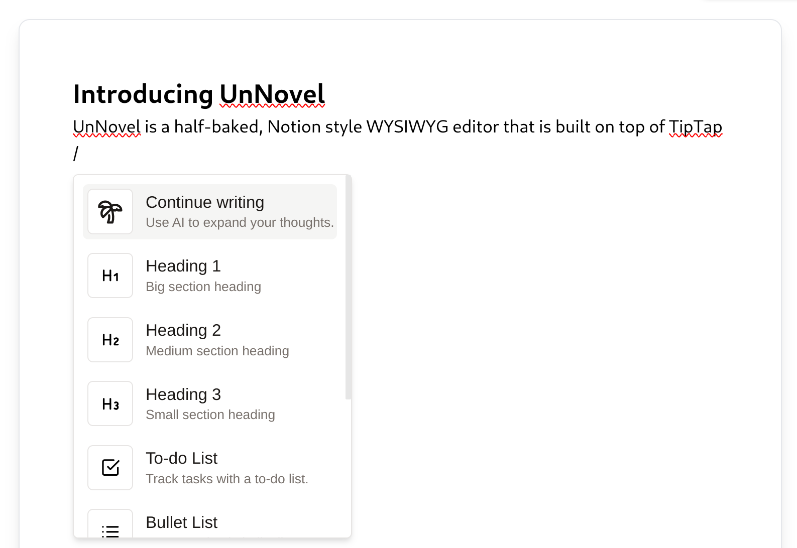

<a href="https://unnovel.abs.moe">
  
  <h1 align="center">UnNovel</h1>
</a>

<p align="center">
  A half-baked open-source Notion-style WYSIWYG editor with AI-powered autocompletions. 
</p>

<p align="center">
  <a href="#introduction"><strong>Introduction</strong></a> ·
  <a href="#setting-up-locally"><strong>Setting Up Locally</strong></a> ·
  <a href="#tech-stack"><strong>Tech Stack</strong></a> ·
  <a href="#contributing"><strong>Contributing</strong></a>
</p>
<br/>

## Introduction

[UnNovel](https://unnovel.abs.moe) is a half-baked open-source Notion-style WYSIWYG editor with AI-powered autocompletions. 


<br />

## Setting Up Locally
To set up Novel locally, you'll need to clone the repository and set up the following environment variables:

```
VITE_PALM_API_KEY_PUBLIC=<your palm api key>
```
_Note: You can get one from [here](makersuite.google.com)_

To run the app locally, you can run the following commands:

```
yarn install
yarn dev
```

<br />

## Tech Stack
UnNovel removed all the garbage from Novel and is now built with the following tech stack:

- [Vite](https://vitejs.dev/) - A fast build tool for Vue.js
- [React](https://reactjs.org/) - A JavaScript library for building user interfaces
- [TypeScript](https://www.typescriptlang.org/) - A typed superset of JavaScript that compiles to plain JavaScript
- [SCSS](https://sass-lang.com/) - A CSS extension language
- [TipTap](https://www.tiptap.dev/) - A renderless rich-text editor
- [Google Gemini](https://ai.google.dev/tutorials/web_quickstart) - A machine learning model that powers the autocomplete feature

<br />

## Contributing
Why?
